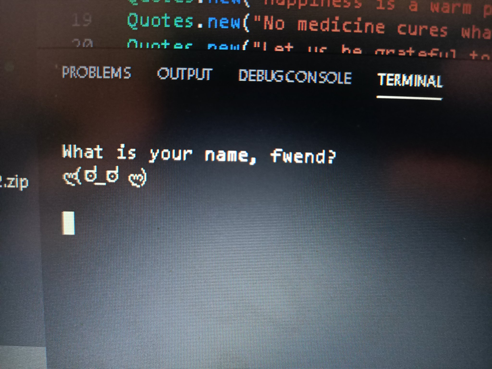

### the Isolation Companion ###

fresh off submitting our first assignment, The class was split in to teams and we had to 
create an application using the skills we had built up as well as prove that we could 
collaborate using Git. 

The idea of the Isolation Companion was pretty simple, a little sprite that would keep you 
company and you would be able to choose how you interacted with it. 

_The companion could:_

1. tell you the date*
2. ask the user for their name
3. fetch news articles and
4. give you an uplifting quote with a randomised kaomoji.

> Kaomoji are the japanese style emoji, made using different symbols, rather than a
> pictograph like regular emoji.

> Kaomoji example - (◕‿◕)

* we wanted to add functionality that told you how many days you had been in isolation, but 
ran out of time to implement it.

### screenshots of the companion ###

---

---

---

