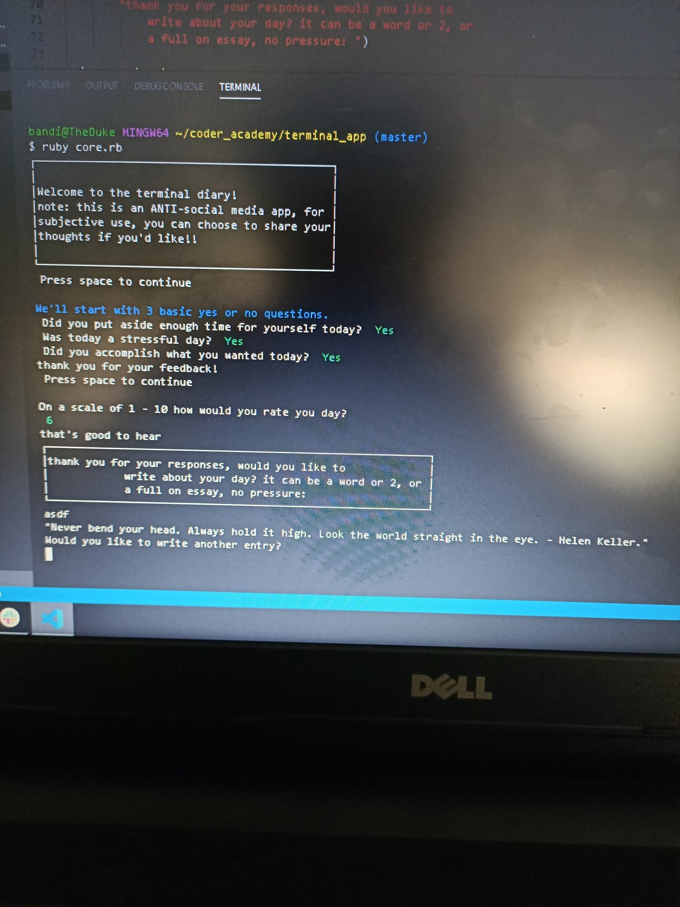
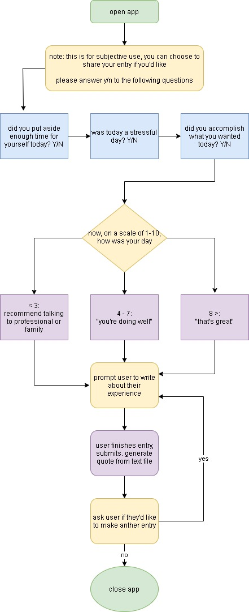

After a few weeks learning the basics of Ruby, my first coding language, we were given our
first project - to create an application that ran in the terminal. 

The main guidelines were:

1. utilise at least 3 Gems
2. user input had to be implemented
3. create documentation

The Terminal diary is an ANTI-social media app, for people who want to write about there 
experience, but don't know who to talk to and don't want to blast there opinions out in 
to the ether like so many social media applications do.

It checks in with how your day was/is going starting with 3 simple yes or no questions, 
then asking for a 1 - 10 rating and then prompting you to make a diary entry. Write down 
anything you want, or split whatever's on your mind over multiple entries. 

At the end of your entry in the previous-entries.txt file an inspirational quote will also 
be generated.

> The application was about 130 lines in total.

 
