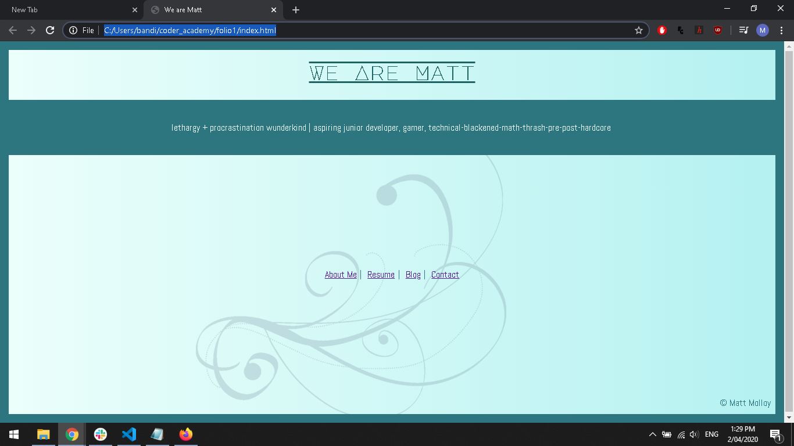
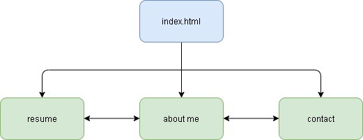
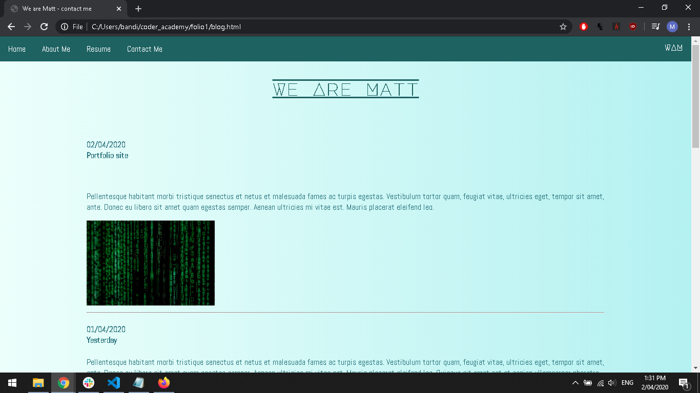
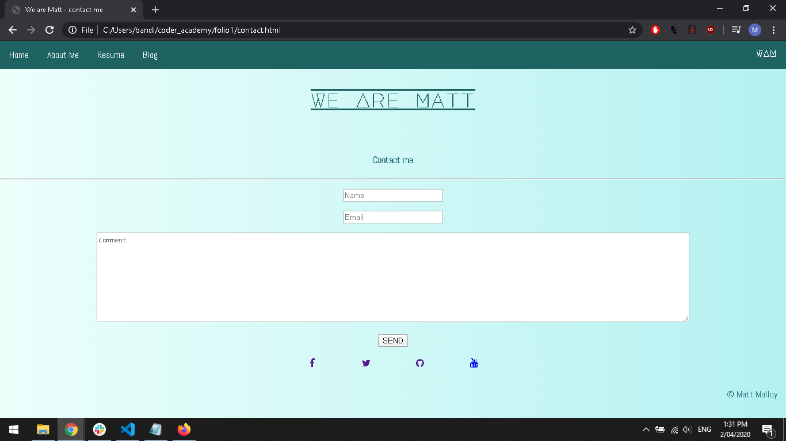

Learning Ruby was a challenging experience overall as it taught me to think in different 
ways. Learning on Campus was a great experience as well, collaborating was so easy, however 
as the pandemic grew in Australia, we have been forced to learn remotely. 

Working online was challenging at first and there were some teething issues, however once we 
were back on our feet, things began moving like they did before.

hosted at: https://mmolloy88.github.io/folio1/src/

## project notes:

---

### Description ###

This is my sumission for my 2nd project for Coder Academy. the purpose of this project is to showcase my ability in working with both HTML and CSS, as well as creating a base to work off and show off my talents as they grow.

---

### Functionality / features ###

> The site was a basic application made from 5 pages all created using only
> HTML and CSS.

#### Navbar ####
who doesn't love a good navbar, links between all the pages in the document 
allowing you to jump through each of the pages without having to manually 
type in the address.

#### Blog ####
a mock up of a blog which could be used to document my journey from learning 
the basic concepts to being a junior full stack developer. where I can write 
out my thoughts and ideas as I learn.

#### Access to my CV ####
making it easy for potential employers to see my employment and study history. 
Also useful in this format because it is a little bit easier than remembering 
where I had last put my documentation. and only have to give out a URL rather 
than updating each time I have to send off the document because it's always in 
one place.

#### Contact page ####
Can be linked to all my professional and social media accounts. making it easier 
for people to get in contact. Also a quick email section which sends emails 
directly to the connected email address.

