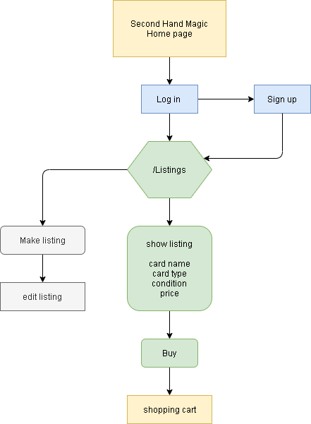
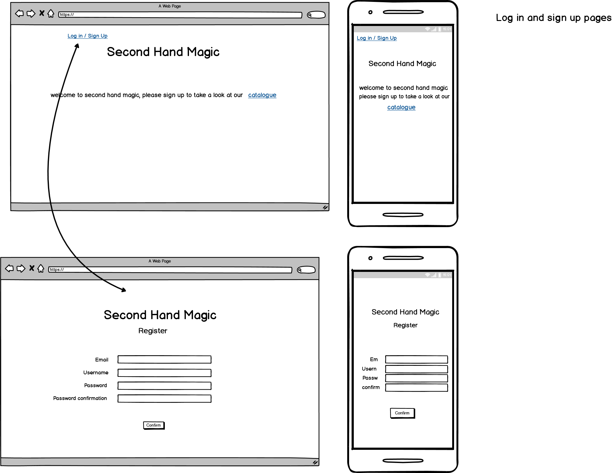
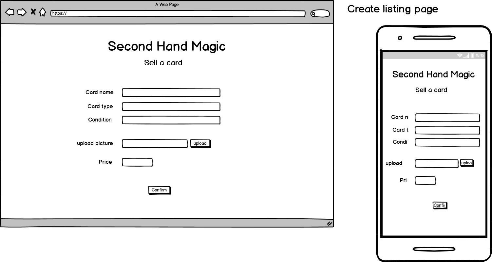
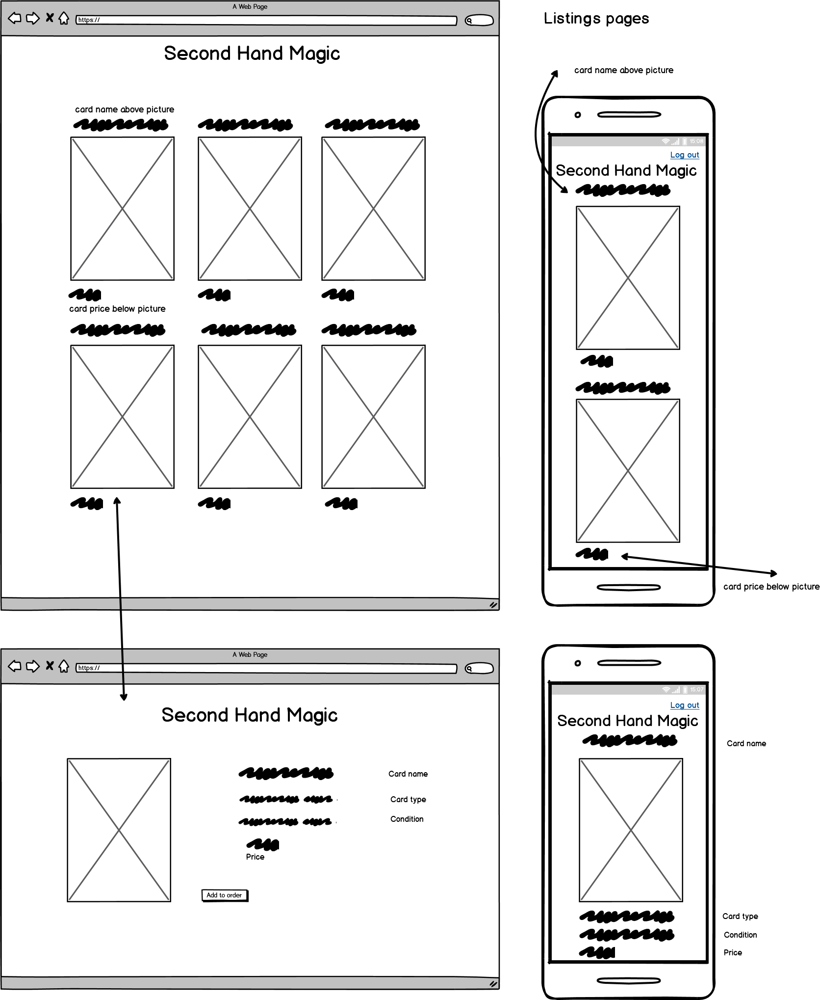

Utilising backend systems for the first time with PostgreSQL was daunting. catagories,
classifications, features all needed to be accounted for in some way, shape or form. 

Second Hand Magic was created out of a hobby that I have -- Magic the Gathering and how to 
get rid of excess trading cards that I had collected.

## Project Notes:

---

#### 1. Explain the different high-level components (abstractions) in your App.

This site allows users to sign up and log in to the website. There is a catalogue of the 
current items for sale that the user can browse through, they may also list their own cards 
on the site. once a listing is made the user that owns the listing can log in and edit or 
delete it, if necessary.

if there is an issue with the listing, for example, there is no price, there will be an 
error message and the person making the listing will be prompted to fix this mistake before 
they are able to submit the listing.

#### 2. List and describe any 3rd party services.
Second Hand Magic is utilises both Heroku to host the project as well as Stripe to send 
Donations to the developer.

The main Ruby gems that have been utilised to run and style Second Hand Magic are:

Bulma gem
Devise gem
Amazon S3
PostgreSQL

#### 3.1. Identify the problem you’re trying to solve by building this particular marketplace App?
While there are already existing marketplaces for second hand Magic: The Gathering cards, my 
goal is to abstract and simplify the process, making it simple for people to list and sell 
there old Magic cards.

#### 3.2 Why is the problem identified a problem that needs solving?
Trading card game products are generally sold in large number and usually come in a 
randomized pack, not knowing what the customer is going to get can be exciting, but often 
leaves them with a surplus of cards that they don't want.

Some retailers offer to buy or trade these cards from the collector, however, particularly 
with the current climate it is hard or impossible to do this in a physical store, 
additionally not every retailer that sells trading cards offers this service.

Having the ability to buy individual cards offers customers the chance to build a deck 
without the cards they want without the aspect of random chance, and the also have the 
chance to sell cards to other people who may want the spare cards that have been previously 
collected.

#### 4. Describe your project’s models in terms of the relationships (active record associations) they have with each other.

The models govern how the different aspects of the application interact with the database. 
For instance, the page that hold all the listings must be named a singular version of the 
controller that governs the CRUD functionalities. "listing.rb" to "listings_ controller.rb" 
there, as well, is where the information if controlled in the database. The same type of 
relationship is present in both the pages and application as a whole.

Additionally aspects like formatting and styling are imported through the application.scss 
file, then styling is added to each of the views.

#### 5. Discuss the database relations to be implemented.

There are 4 main catagories that are stored in the application. They are the Users and their 
log in information, the listings, which a single user may have many listed on the site. As 
well as the orders that can be made, which can be made up of multiple items but only 1 order 
can be placed at one time.

#### 6. Provide your database schema design.
The key relations in the database are:

   user has_many listings; the user has the ability to make multiple entries, however the 
   ability to edit and delete means that each listing has_one User. 

   a listing has_one ID, but when an order is placed, the order has_many IDs if the customer 
   is buying multiple items. 

#### 7. Provide User stories for your App.
As someone who previously collected MTG I have a large collection of cards that aren't in 
decks that I'd like to get rid of. If I choose to make another Deck, I'd also like to be 
able to select specific cards to be able to do it.

Someone who collects the cards, rather than plays Magic, would want a large selection of 
cards from various series in the games history in good condition. Access to photos of the 
cards in order to verify that they are the ones the collector is after.

If a user is creates a profile and any listings using that information, no other user should 
be able to change or delete that information.

#### 8. Wireframes.

---

---

