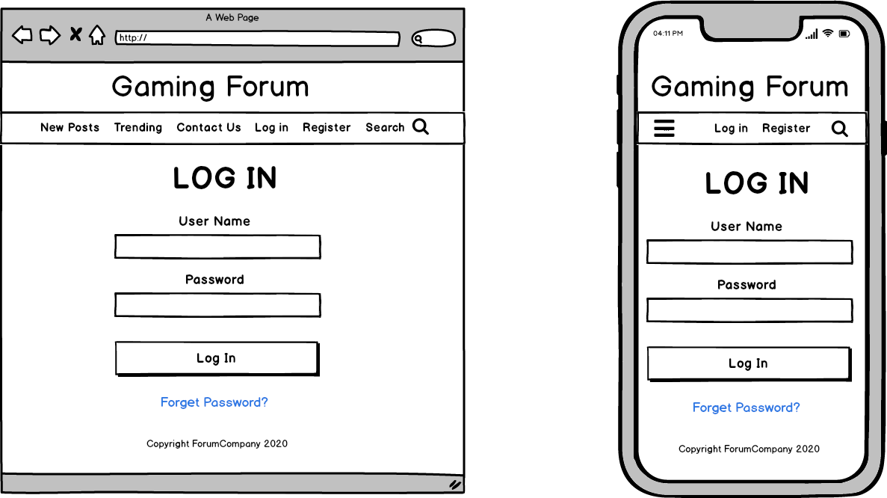
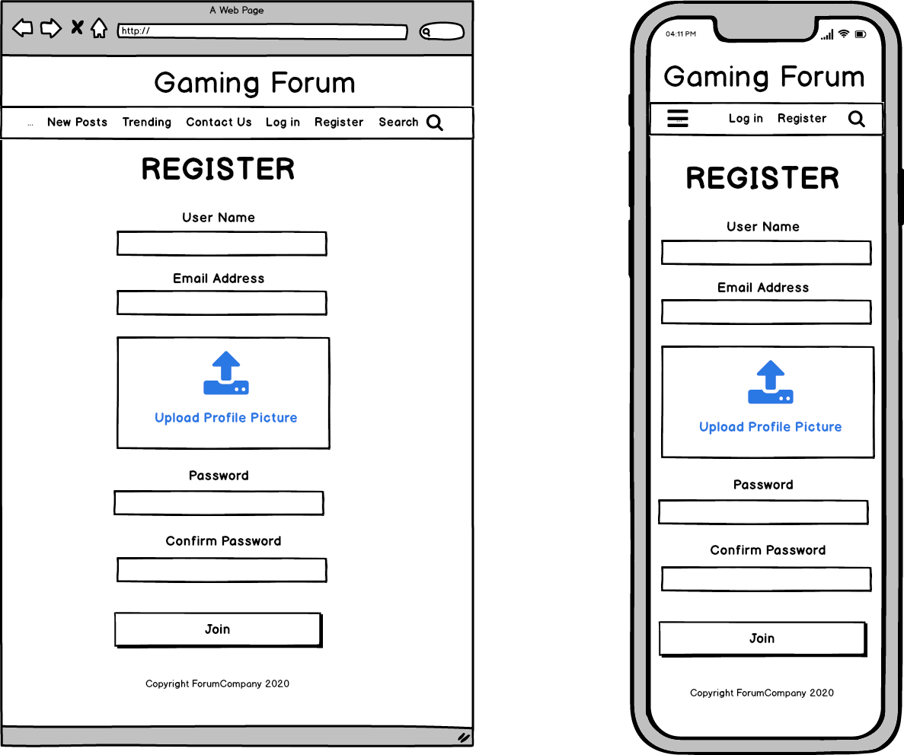
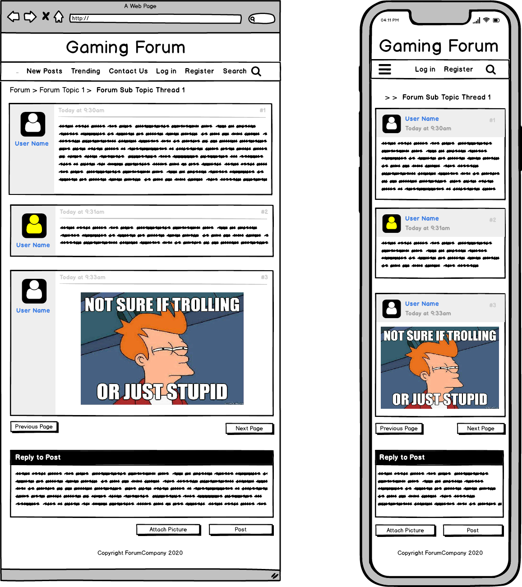

By this point of the course we had been learning Javascript. starting with basic funtions to utilising different JS frameworks:

> **MongoDB** - Document oriented database where all the recorded information is stored. used in many current web applications 
>
> **ExpressJS** - Server framework that is utilised in conjunction with NodeJS, Express is used to handle HTTP requests 
>
> **ReactJS** - This powerful tool is used to create the UI(User Interface) and single page applications
>
> **NodeJS** - An event driven framework that handles inputs and outputs

Also known as the MERN stack.

Working towards the end of the coding boot camp, we were put in to small groups and had to create a full application. My group created the Gamerspace forum - a place where people could discuss retro games. 

## Project Notes:

---

#### URL: gamerspace.compuconsultations.com

#### github repo: https://github.com/ChrisR32/Gamerspace

### **Gamerspace**

*developed by Christopher Morris and Matthew Molloy*

is an online forum where people can discuss, review and post about classic video games. The user is able to create a log in with their email, a password and make a username. From there, the user can create new posts or view and comment on an existing post. The user will also be able to upload images with their posts.

The main target market for Gamerspace is gamers, this group is fairly varied and has people from many different backgrounds and lifestyles, but predominantly consisting of males between the ages of 15-35. With this varying userbase we expect the interaction between users to be equally as broad and will be utilising admin roles. Similarly to regular roles, the admin will be able to comment and post, but will also have the ability to delete inappropriate posts and ban users if need be.

The majority of Gamerspace is created using the MERN stack, a combination of frameworks and tools written in JavaScript - Mongo Data Base, Express, React and Node. This full stack covers both the frontend where end users interact with the site and the backend where information is stored. 

#### Wireframes & Diagrams

---

---

---

