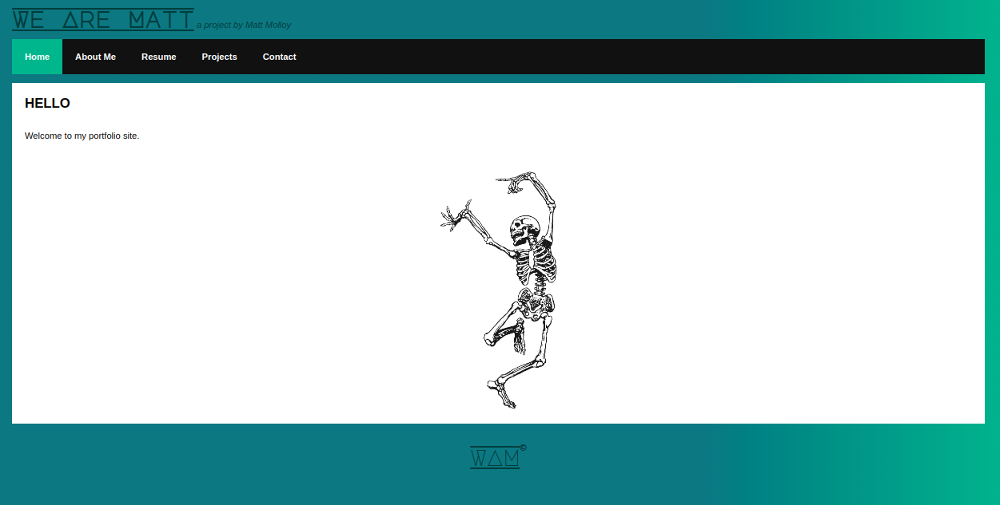

During my two weeks working on Gamerspace, I had some down time due to my team mate 
connecting to the NBN and not having internet for 4 days. During this hiccup, I developed an updated version of my portfolio, using the same information, but using React to conform it all to a single page application.  

##### > [Hosted on Netlify](https://wearematt88.netlify.app/ "wearematt88.netlify.app")

Creating this new website, was an interesting process. Initially I implemented the React Tic Tac Toe tutorial as a component in the SPA, however, this was not responsive and did not work as intended on mobile devices. Additionally the postitioning of my social media links was difficult at first to get right.  

The end product (which I'm still working on as my skill set grows) is something I am proud of. 

